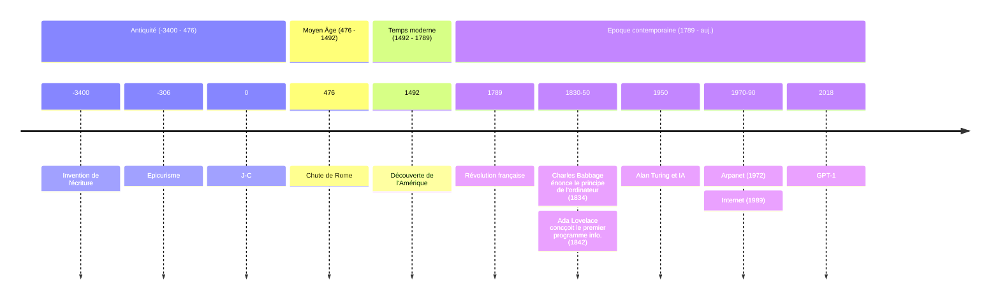

# Ataraxie numérique

Repenser notre rapport à l’outil, rechercher le bonheur dans la sobriété

<!--
The last comment block of each slide will be treated as slide notes. It will be visible and editable in Presenter Mode along with the slide. [Read more in the docs](https://sli.dev/guide/syntax.html#notes)
-->

---
layout: center
---

# J'ai un problème : je suis ingénieur

<v-click>Problème technique = solution technique</v-click>

---
layout: cover
background: ./images/candles.jpg
---

# Science, numérique, IA

Dieux, apôtres et messies

---
layout: center
---

# Définition

L’**ataraxie** (du grec ἀταραξία, signifiant « absence de troubles »), au sens épicurien, consiste en un état de profonde quiétude, impliquant l’**absence de tout trouble** ou souffrance.

---
layout: cover
background: ./images/Epicure.jpg
---

# Epicure

## (de rappel)

---

# De l'antiquité au numérique

---
layout: image-left
image: ./images/Jesus.jpg
class: bg-black
---

<v-switch>
  <template #1-3>
    
  </template>
  <template #2>
    

      *Young Men's Christian Association
    

  </template>
  <template #3>
    

     -> Y -> Why -> Pourquoi ?
    

  </template>
</v-switch>

---
layout: center
---

# L'épicurisme… 

…est un courant issu de la philosophie antique ayant pour objectif principal **l'atteinte du bonheur par la satisfaction des seuls désirs « naturels et nécessaires »**. 

(Source : Wikipédia)

---
layout: center
---

# Selon Epicure… 

il faut « **agir sobrement** en recherchant les actions amenant l'absence de douleur, d'où doit découler le plaisir négatif de cet état de repos (ataraxie), dont la pleine conscience procure le plaisir suprême ; 

**la clef du bonheur est de connaître ses propres limites** ; c'est pourquoi l'excès doit être évité car il apporte la souffrance. »

(Source : Wikipédia)

---
layout: center
---

# Classification des désirs selon Épicure

 

<table cellpadding="5">
  <tbody>
    <tr>
      <th colspan="4"><strong>Désirs naturels</strong>
      </th>
      <th colspan="2"><strong>Désirs vains</strong>
      </th>
    </tr>
    <tr>
      <th colspan="3"><strong>Nécessaires</strong>
      </th>
      <td><strong>Simplement naturels</strong>
      </td>
      <td><strong>Artificiels</strong>
      </td>
      <td><strong>Irréalisables</strong>
      </td>
    </tr>
    <tr>
      <td>Pour le bonheur (ataraxie)
      </td>
      <td>Pour la tranquillité du corps (aponie)
      </td>
      <td>Pour la vie (nourriture, sommeil)
      </td>
      <td>Variation des plaisirs, recherche de l'agréable
      </td>
      <td><abbr class="abbr" title="Exemple">ex.&nbsp;:</abbr> richesse, gloire
      </td>
      <td><abbr class="abbr" title="Exemple">ex.&nbsp;:</abbr> désir d'immortalité
      </td>
    </tr>
  </tbody>
</table>

---
layout: center
---

# Bonheur ≠ plaisir

Le numérique sait déclencher des plaisirs artificiels en sa faveur ([*fake dopamine*](https://umvie.com/revelant-les-dangers-du-fake-dopamine-comment-eviter-les-pieges-du-bonheur-artificiel/))

---
layout: image-left
image: ./images/socrate-ordinateur.avif
class: bg-black h-full flex
---

  <h1 class="flex text-white">Les philosophes grecs n'avaient pas le numérique…</h1>
  
  <v-click>
    <h3 class="text-white">essayons de voir ça dans notre contexte "moderne"</h3>
  </v-click>

---
layout: default
---

# Hierarchiser nos besoins

Les besoins humains de base selon [Kate Raworth](https://fr.wikipedia.org/wiki/Kate_Raworth), inspirés des 17 Objectifs de Développement Durable :

<v-clicks>

- Ressources physiques : 
  - **Alimentation** suffisante
  - **Eau potable** et conditions sanitaires décentes
  - Accès à l’**énergie** et à un équipement de cuisine propre
- Services :
  - Accès à un **logement** correct
  - Accès à l’**éducation** 
  - Accès aux soins de **santé**
  - **Revenu minimum** et **travail digne** de ce nom
  - Accès aux réseaux d’**information** et de soutien social
- Respect de plusieurs principes : 
  - Respect de l’**égalité des sexes**
  - Respect de l’**équité sociale**
  - Respect de la **représentation politique**
  - Respect de la **paix** et de la **justice**

</v-clicks>

---
layout: center
---

# C'est bien beau tout ça

## mais on est loin du contexte "numérique"

---
layout: center
---

# Que serait l’ataraxie **numérique** ?

Littéralement, l'absence de trouble lié au numérique

<v-clicks>

Pour les éviter, il faut identifier les troubles.

Il faut définir ce en quoi les outils numériques nous sont **nécessaires**, **utiles**, même **agréables**.

**Réévaluer nos besoins**, **analyser les outils** pour ne retenir que ceux qui nous rendent **autonomes** et heureux, ceux qui sont **conviviaux** (au sens décrit par Yvan Illich).

**Changer notre rapport à la technique**.

</v-clicks>

---

# Identifier/analyser les "troubles"

 

<v-clicks>

- **Santé** : mobilité, mental, sommeil, pollutions…
- **Éducation** : [troubles du comportement, visuels, anxiodépressifs](https://sante.gouv.fr/prevention-en-sante/sante-des-populations/enfants/exposition-aux-ecrans/article/enfants-et-ecrans-des-risques-sanitaires-reels-un-accompagnement-necessaire), [atrophie cognitive](https://www.polytechnique-insights.com/tribunes/neurosciences/ia-generative-le-risque-de-latrophie-cognitive/), [perte de compétence](https://etudiant.lefigaro.fr/article/etudes/les-jeunes-sont-de-plus-en-plus-diplomes-mais-pas-forcement-plus-competents-selon-l-ocde-20250909/)…
- **Social** : liberté, libre arbitre, influence, ingérance/géopolitique, surveillance, colonialisme…
- **Empouvoirement** : [obsolecensce logicielle](https://www.halteobsolescence.org/obsolescence-logicielle/), [technique](https://www.halteobsolescence.org/obsolescence-technique/) et [marketing](https://www.halteobsolescence.org/obsolescence-marketing/), [enfermement technologique](https://www.april.org/la-commission-europeenne-tire-la-sonnette-dalarme-de-lenfermement-technologique-des-administrations), [techno-feodalisme](https://shs.cairn.info/techno-feodalisme-une-logique-de-regression?lang=fr)…
- **Information** : *fake news*, [emmerdification du web](https://framablog.org/2025/04/02/un-grand-pouvoir-mais-aucune-responsabilite/), [infobésité](https://www.infobesite.org/)…

</v-clicks>

<v-click>

Petit bonus : "[La face cachée de la philo sur Youtube](https://www.youtube.com/watch?v=rJE2qkP0Gk4)" par Monsieur Phi pour faire le lien entre (em)merdification du web et philosophie.

</v-click>

--- 
layout: center
---

# Là, c'est un peu la déprime…

<v-click>Heureusement, l'IA va nous sauver !</v-click> <v-click>Nan, je déconne 🤣</v-click>

---
layout: center
---

Revenons à ce que disait Epicure

la clef du bonheur est de connaître ses propres limites

---
layout: cover
background: ./images/stop-hand.jpg
class: bg-black
---

## Connaitre ses propres

# LIMITES

<v-click>

pour ne pas les dépasser

(apparemment tout le monde n'a pas compris le principe de limite)

</v-click>

---
layout: center
---

Précisons ici que les limites personnelles, même si on pouvait les définir, seraient à géométrie variable.

<v-click>
  Et dans un contexte mondialisé, il va falloir une approche holistique*.
</v-click>

<v-click>
  

    *qui prend en compte une chose dans sa totalité, qui analyse quelque chose sans le diviser en parties, qui traite le tout plutôt qu'une section.
  

</v-click>

---
layout: cover
background: ./images/terre-plate.avif
class: bg-black
---

# Limites planétaires

---
layout: image-left
image: './images/Planetary Boundaries 2023.png'
backgroundSize: 95%
---

# 9 limites planétaires

1. réchauffement climatique ;
2. acidification des océans ;
3. pollution chimique ;
4. charge d'azote et de phosphore
5. consommation d'eau douce 
6. conversion des terres ;
7. perte de biodiversité ;
8. pollution de l'air ;
9. appauvrissement de la couche d'ozone.

--- 
layout: image
image: './images/Planetary boundaries over time - stockolm resilience center.png'
backgroundSize: 95% 70%
---

# Évolution des limites planétaires depuis 2009

---
layout: center
class: text-center
---

# Maintenant qu'on sait ça, 

## on se sent tout de suite mieux ! Non ?

---
layout: cover
background: ./images/limits.jpg
---

# Peut-on intégrer des limites humaines aux limites planétaires ?

## Nos besoins nécessaires dans la finitude du monde

---
layout: center
---

# Réponse courte : a priori, oui !

Sauf que ça demande de changer plus que le modèle économique dominant (la croissance), il faut aussi changer l'idéologie sous-jacente

--- 
layout: image-right
image: './images/doughnut.jpg'
backgroundSize: 95% 
---

# L'économie du Donut

Satisfaire les besoins des personnes tout en préservant les conditions environnementales.

Allier les limites humaines aux limites planétaires.

--- 
layout: image
image: './images/Doughnut-transgressing.jpg'
backgroundSize: 45% 
---

Le « Donut » et ses indicateurs montre dans quelle mesure les plafonds écologiques sont dépassés et les fondements sociaux ne sont pas encore atteints.

<v-click>

  🎁 En cadeau à la fin de cette présentation, une corde et un manuel rédigé par Chat-GPT sur les nœuds à coulisse

</v-click>

---
layout: center
---

# On avance, la question se précise :

Où et comment définir les limites numériques dans tout ça ?

---
layout: center
class: bg-black
transition: none
---

# C'est là que Jésus revient

---
layout: center
class: bg-black
---

# ou plus exactement cette histoire de Y 

---
layout: image-right
image: ./images/strategie-du-y.png
---

# La stratégie du Y

Développer/rediriger la stratégie d'entreprise dans les limites planétaires

<v-clicks>

On se rapproche un peu plus du numérique…

</v-clicks>

---
layout: cover
background: ./images/welcome-to-sodom.jpg
---

# Peut-on définir des [limites numériques](https://limitesnumeriques.fr/) ?

## Si oui, comment ?

---
layout: center
---

# On ne va pas se mentir : c'est chaud patate !

On pourrait statuer démocratiquement sur toutes les innovations techniques et avoir pour règle :  « Tu ne te conformeras point à ce monde qui t'entoure »*.

<v-click>
  
*C'est littéralement le mode de fonctionnement des Amish décrit sur Wikipédia 😉

</v-click>

<v-click>
  Sans parler du fait qu'on est dans une démarche qui sera perçue comme étant à contre-courant…
</v-click>

<v-click>
  
Alors : Amish ou Ennemish ? On fait quoish et commensh ?

</v-click>

---
layout: center
class: text-5
---

  Comme l'explique [Stéphane Crozat](https://aswemay.fr/co/040011_1.html), 

Il ne s'agit pas d'établir un décalogue, d'édicter une morale, mais de forger une éthique hédoniste (ou eudémoniste) où **le bonheur est la finalité de la raison**. 

<v-click>

  
  Des fois que, comme moi, tu n'aies pas tout compris :

  - **Décalogue** : ensemble des dix commandements divins transmis à Moïse selon la tradition biblique. 
  - **Hédoniste** : doctrine philosophique selon laquelle la recherche de plaisirs et l'évitement de souffrances constituent le but de l'existence humaine.
  - **Eudémoniste** : théorisé notamment par les Épicuriens et les Stoïciens, qui considèrent la recherche du bonheur, plutôt que de plaisirs, comme but de la vie humaine.
  

</v-click>

<v-click>

Il s'agit donc de **chercher des moyens de penser pour mieux vivre avec nos objets techniques**.

</v-click>

---
layout: center
---

# La démarche low-tech appliquée au numérique

Définir un **cadre contraint**, rechercher un **état stationnaire**, une **médéité** (perfection dont on ne peut rien retrancher sans y perdre et à laquelle ajouter est superflu).

<v-click>
Stationnaire ne signifie pas statique !
</v-click>

---
layout: center
---

# Même si on a pas d'idée claire des limites,  on peut co-construire les contraintes

<v-clicks>

- Contrainte matérielle (durable, réparable, recyclable…)
- Contrainte logicielle (libre, open-source, démocratique…)
- Contrainte d'usage (temps, destination, cycle de vie…)

</v-clicks>

---
layout: center
---

# Guider nos choix

Stéphane Crozat (encore lui) propose la méthode suivante :

- Eviter le couplage entre **techniques nécessaires** et **besoins nécessaires** ;
- Approbation démocratique des **techniques non nécessaires** aux **besoins nécessaires** ;
- Les **techniques non nécessaires** pour les **besoins non nécessaires** sont facilement substituable. Elles peuvent tout de même être évaluées au regard de leur impact environnemental et leurs potentiels d'addiction ;
- Les **techniques nécessaires** pour les **besoins non nécessaires** sont les premières à réinterroger. 

---
layout: center
---

# En somme, il va falloir dénumériser

et repenser ce qu'on garde

---
layout: image-right
image: ./images/punkt-phone.jpg
---

# Quelques idées

- [Forfait mobile limités](https://telecoop.fr/particuliers/forfaits-mobile/forfait-sobriete)
- Téléphone aux [fonctionnalités restreintes](https://www.punkt.ch/en/products/mp02-4g-mobile-phone/)
- [Location de matériel électronique éco-conçu](https://commown.coop/)
- Location/échange de films/musiques sur supports physiques
- Offre Internet à débit réduit
- Un ordinateur par foyer, un tél portable par personne pour 10 ans*…
- …

<v-click>

  *Selon une étude universitaire ["Democratizing provisioning systems: a prerequisite for living well within limits, Sustainability: Science, Practice and Policy,"](https://www.tandfonline.com/journals/tsus20)

</v-click>

---
layout: center
---

# Est-ce que tout cela peut nous mener à l'ataraxie et contribuer à notre bonheur ?

<v-clicks>

Je pense que oui, si on fait l'effort de continuer à se poser la question.

Et vous ? 

</v-clicks>

---
layout: end
---

# Merci de m'avoir écouté

---
layout: default
---

# Crédits et bibliographie

 

<!-- Toilettes sèches : photo de <a href="https://unsplash.com/fr/@rstar50?utm_content=creditCopyText&utm_medium=referral&utm_source=unsplash">Roger Starnes Sr</a> sur <a href="https://unsplash.com/fr/photos/porte-en-bois-marron-sur-branches-darbre-en-bois-marron-3axehLxchXo?utm_content=creditCopyText&utm_medium=referral&utm_source=unsplash">Unsplash</a> -->

- Un peu de lecture
  - "La convivialité", Ivan Illich 
  - "Faut-il se passer du numérique", Cédric Durant
  - "Epicure et l'économie du bonheur", Etienne Helmer
  - "Changer de boussole, La croissance ne vaincra pas la pauvreté", Olivier de Schutter
  - "[How to build a low-tech internet](https://openlibrary.org/books/OL50543280M/How_to_build_a_low-tech_internet)", Kris de Decker, Marie Otsuka et Roel Roscam Abbing
  - "[La ville stationnaire, Comment mettre fin à létalement urbain ?](https://actes-sud.fr/catalogue/nature-et-environnement/la-ville-stationnaire)", Philippe Bihouix, Sophie Jeantet, Clémence De Selva
  - "Low-tech journal", divers numéros
  - "Libérer le temps", hors-série Socialter
  - Rapport "[Digital Reset](https://digitalization-for-sustainability.com/digital-reset/)", D4S
  - "[Lean ICT - Pour une sobriété numérique](https://theshiftproject.org/app/uploads/2025/02/Rapport-final-v8-WEB.pdf)", The Shift Project
  - "[Vers une ataraxie numérique : low-technicisation et convivialité](https://aswemay.fr/co/040011.html)", Stéphane Crozat
  - "[Democratizing provisioning systems: a prerequisite for living well within limits, Sustainability: Science, Practice and Policy](https://www.tandfonline.com/journals/tsus20)", Julia Steinberger, Gauthier Guerin, Elena Hofferberth & Elke Pirgmaier (2024)
  - Théorie du donut et dépassements par [DoughnutEconomics](https://commons.wikimedia.org/w/index.php?curid=75695170) — CC BY-SA 4.0
  - Limites planétaires : [Stockolm Resilience Center](https://www.stockholmresilience.org/research/planetary-boundaries.html)
- Images
  - Grillage : photo de <a href="https://unsplash.com/fr/@abject?utm_content=creditCopyText&utm_medium=referral&utm_source=unsplash">benjamin lehman</a> sur <a href="https://unsplash.com/fr/photos/gros-plan-dune-cloture-a-mailles-de-chaine-LbEOZyGFdHU?utm_content=creditCopyText&utm_medium=referral&utm_source=unsplash">Unsplash</a>
  - Jesus : photo de <a href="https://unsplash.com/fr/@massimovirgilio?utm_content=creditCopyText&utm_medium=referral&utm_source=unsplash">Massimo Virgilio</a> sur <a href="https://unsplash.com/fr/photos/une-statue-de-jesus-sur-une-croix-dans-lobscurite-A4H1z8tPQKE?utm_content=creditCopyText&utm_medium=referral&utm_source=unsplash">Unsplash</a>
  - Terre plate par [egal sur iStock](https://www.istockphoto.com/fr/photo/%C3%A9cran-de-terre-gm887259802-246261624)
  - Stop piéton : photo de <a href="https://unsplash.com/fr/@chandu029?utm_content=creditCopyText&utm_medium=referral&utm_source=unsplash">Dust & Pixels</a> sur <a href="https://unsplash.com/fr/photos/un-feu-rouge-avec-un-signal-de-la-main-dessus-1RKTMTT-tZM?utm_content=creditCopyText&utm_medium=referral&utm_source=unsplash">Unsplash</a>
  - Bougies : photo de <a href="https://unsplash.com/fr/@labrum777?utm_content=creditCopyText&utm_medium=referral&utm_source=unsplash">Mike Labrum</a> sur <a href="https://unsplash.com/fr/photos/photo-en-contre-plongee-de-bougies-allumees-fvl4b1gjpbk?utm_content=creditCopyText&utm_medium=referral&utm_source=unsplash">Unsplash</a>
  - Socrate devant un ordinateur : image prise sans consentement à Freepik qui promeut des images générées par IA, elles aussi sans consentement des auteurs plagiés 😝.
- Support de slides : https://sli.dev
  

